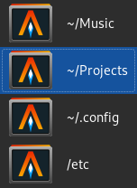

sway-atas
================================================================================

A simple application switcher for the sway window manager.

List all open application windows as a simple grid.


Or display sibling windows of the active application.




Installation
--------------------------------------------------------------------------------

Requires

 - gtk+-3.0
 - wayland-client
 - gio-unix-2.0
 - json-c

```
git clone https://github.com/emcconville/sway-atas.git
cd sway-atas
meson build
ninja -C build
cp ./build/sway-atas ~/.local/bin/sway-atas
```

Usage & Set-up
--------------------------------------------------------------------------------

Edit `.config/sway/config`, and bind keyboard keys to `sway-atas`.

```
bindsym Alt+Tab exec ~/.local/bin/sway-atas
bindsym Alt+Grave exec ~/.local/bin/sway-atas --list --siblings
```

 